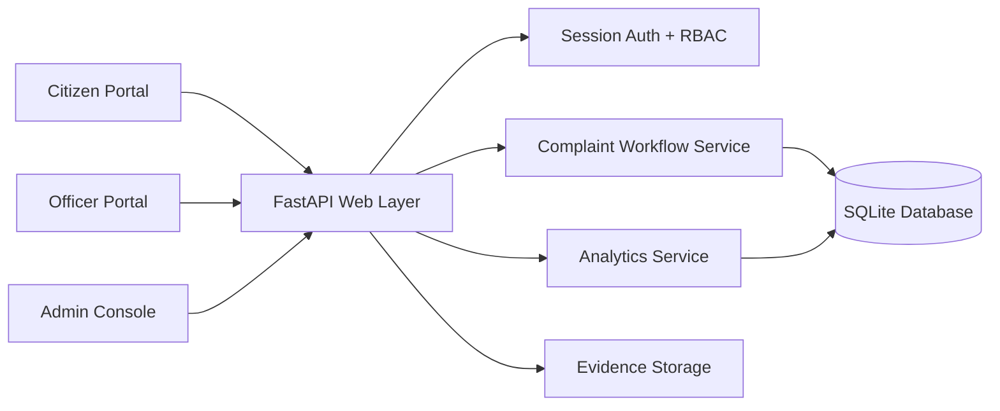
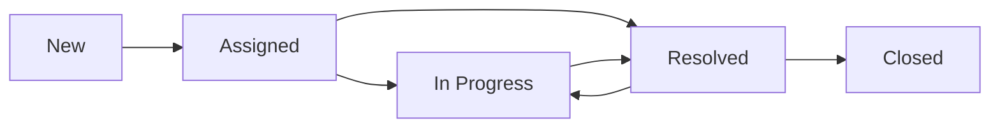
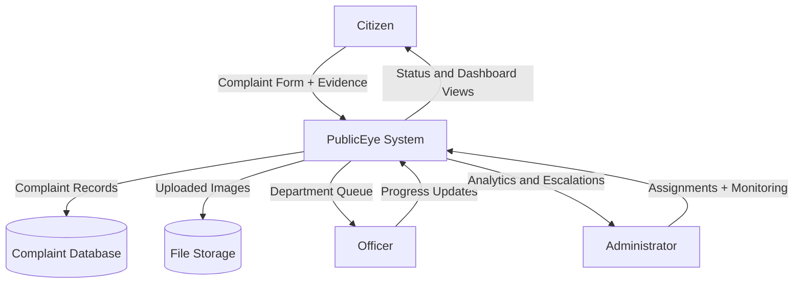
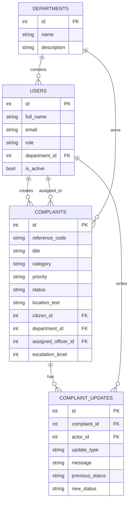
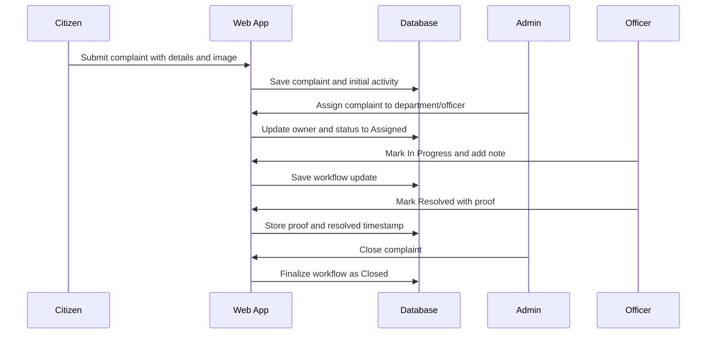
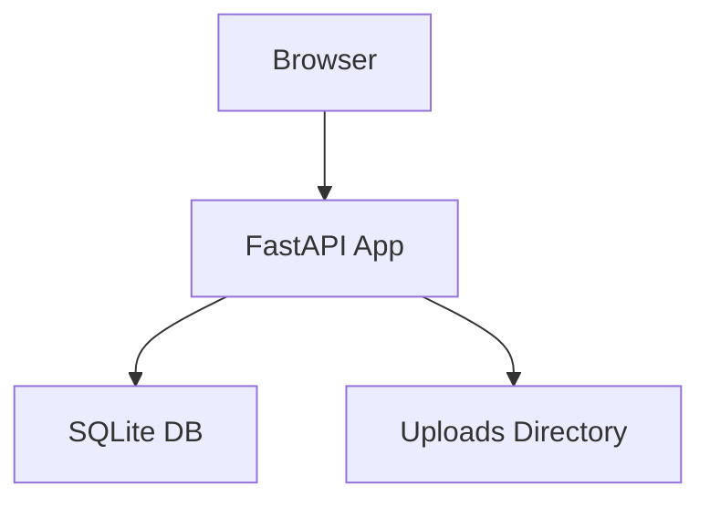

# System Schematics

## 1. System Architecture Diagram

## 2. Complaint Workflow

## 3. Data Flow Diagram

## 4. ER Diagram

## 5. Sequence Diagram for Complaint Handling

## 6. Deployment Schematic

